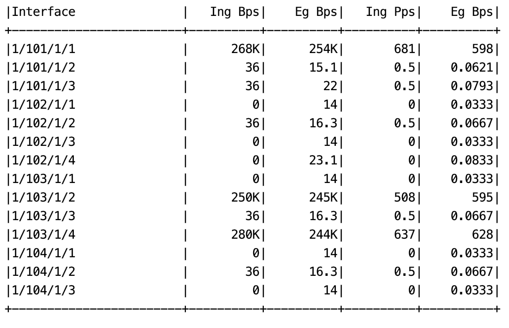
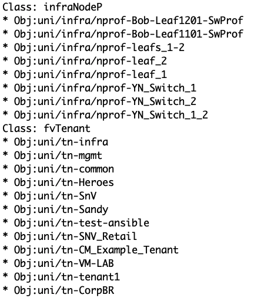

# aci_monitor
> A simple python library to query interface status from Cisco APIC.

## Table of contents
* [General info](#general-info)
* [Screenshots](#screenshots)
* [Setup](#setup)
* [Features](#features)
* [Status](#status)
* [Inspiration](#inspiration)
* [Contact](#contact)

## General info
The purpose of this project is to generate a REST call to Cisco APIC and show interface throughput statistics. New function enables querying objects inside the specified classes.

## Screenshots

## Setup
* Clone the project
* Change the APIC's IP and credentials in settings.json
* Modify the intf_list.json and add the interfaces to monitor

## Code Examples
Show examples of usage:  To show interface stats: python main.py  To list objects inside classes: python class_query.py

## Features
List of features ready and TODOs for future development
* Monitor interface's ingress/egress Bps and Pps
* List object names based on the specified classes

To-do list:
* Add other type of queries

## Status
Project is: _in progress_

## Inspiration
Project inspired by many customer requests for a simple way to monitor switch interfaces.
Thanks README.md template from https://github.com/ritaly/README-cheatsheet

## Contact
Created by [@stantiku](https://github.com/stantiku) - feel free to contact me!
